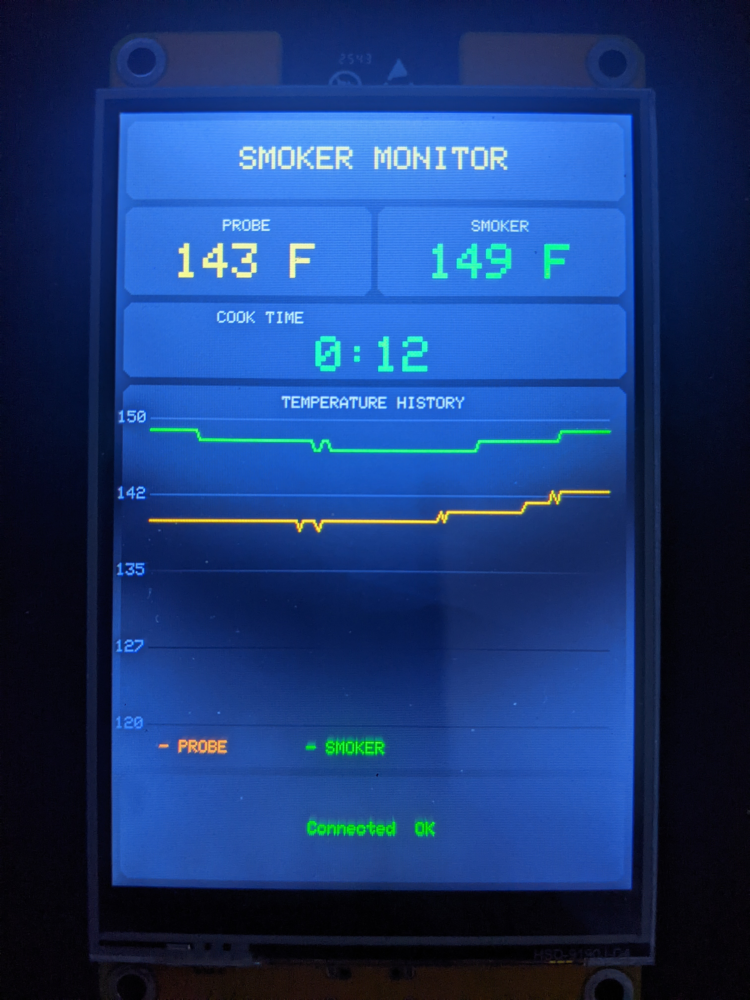

# Masterbuilt Smoker BLE Monitor — CYD Display

- Made with Claude AI
- A working Arduino project that connects a **Cheap Yellow Display (CYD)** to a **Masterbuilt 20070215 Bluetooth electric smoker** and shows live probe and box temperatures on the touchscreen.

> This repo documents the full journey: hardware setup, BLE reverse engineering, dead ends, and the final working solution. If you landed here searching for Masterbuilt BLE protocol info — you're in the right place.
>
> 

---

## Hardware

| Part | Details |
|------|---------|
| CYD Board | [Hosyond 4" ESP32-3248S040 CYD](https://www.lcdwiki.com/4.0inch_ESP32-32E_Display) |
| Screen | ST7796, 320×480, SPI |
| Touch | XPT2046 (currently not used) |
| MCU | ESP32 (onboard) |
| Smoker | Masterbuilt 20070215, 40" Bluetooth model |
| Smoker BLE chip | Texas Instruments CC254x (estimated) |
| Connection | Bluetooth Low Energy 4.0, no pairing/bonding required |

---

## Software
- [Arduino IDE](https://www.arduino.cc/en/software) for the CYD
- nRF Connect [IOS App](https://apps.apple.com/us/app/nrf-connect-for-mobile/id1054362403)   [Andriod App](https://play.google.com/store/apps/details?id=no.nordicsemi.android.mcp&hl=en_US)   [Desktop](https://www.nordicsemi.com/Products/Development-tools/nRF-Connect-for-Desktop?utm_feeditemid=&utm_device=c&utm_term=&utm_source=google&utm_medium=ppc&utm_campaign=Pmax+%7C+Wi-Fi+%7C+US&hsa_cam=23209587568&hsa_grp=&hsa_mt=&hsa_src=x&hsa_ad=&hsa_acc=1116845495&hsa_net=adwords&hsa_kw=&hsa_tgt=&hsa_ver=3&gad_source=1&gad_campaignid=23205419936&gbraid=0AAAAADPygHIKDIqOxaDnVAOG_assCtYwZ&gclid=Cj0KCQjwqPLOBhCiARIsAKRMPZpE52z5u121EgEB7xXOnOGTUD3MXlXGwLCPHHOBC8Nn0Mhy4Hp6kzwaAuCpEALw_wcB) This is used to find the info on the bluetooth device you're connecting to [Here's how to use it](https://github.com/CJM01/CYD-to-Masterbuilt-Smoker/blob/main/docs/nrf_connect_guide.md)

## Libraries for the Arduino IDE

| Library | Version tested | Notes |
|---------|---------------|-------|
| TFT_eSPI | latest | Requires custom `User_Setup` — see below |
| NimBLE-Arduino | latest (h2zero) | **Do NOT use the built-in ESP32 BLE library** — see [Lessons Learned](docs/lessons_learned.md) |

---

## TFT_eSPI User_Setup

Place this in your TFT_eSPI `User_Setup.h` (or `User_Setup_Select.h`):

```cpp
#define ST7796_DRIVER
#define TOUCH_CS 33

// Hosyond 4" ESP32-3248S040
#define TFT_MISO 12
#define TFT_MOSI 13
#define TFT_SCLK 14
#define TFT_CS   15
#define TFT_DC    2
#define TFT_RST  -1
#define TFT_BL   27
#define TFT_BACKLIGHT_ON HIGH

#define LOAD_GLCD
#define LOAD_FONT2
#define LOAD_FONT4
#define LOAD_FONT6
#define LOAD_FONT7
#define LOAD_FONT8
#define LOAD_GFXFF
#define SMOOTH_FONT

#define SPI_FREQUENCY       27000000
#define SPI_READ_FREQUENCY  20000000
#define SPI_TOUCH_FREQUENCY  2500000
```

Touch calibration (__Not used or needed for this project__ but here incase you want buttons or tabs help):
```cpp
uint16_t calData[5] = { 305, 3590, 251, 3482, 7 };
tft.setTouch(calData);

NOTE: This is my calibration for this board and should work with similar size screens, should.
      There's a screen calibration tool in Arduino: Files/Examples/TFT-eSPI/Generic/Touch_calibrate
      The output is displayed in the Arduino Serial Monitor, Tools/Serial Monitor
      This is for trouble shooting issues when touching the screnn doesn't align with the button/screen layout
```

---

## Quick Start

1. Install **NimBLE-Arduino** via Arduino Library Manager
2. Configure `TFT_eSPI` User_Setup as above
3. Use nRF Connect to find bluetooth info
4. Open and edit `src/Masterbuilt_Temp/Masterbuilt_Temp.ino`
5. Flash to your CYD
6. Power on the smoker — the CYD connects automatically and displays live temps

---

## Files

```
src/
  Masterbuilt_Temp/
    Masterbuilt_Temp.ino      ← main sketch (final working version)

tools/
  smoker_diagnostic/
    smoker_diagnostic.ino     ← BLE diagnostic — dumps all raw bytes to Serial Monitor
                                 Use this if temps look wrong on a different unit

docs/
  ble_protocol.md             ← Full reverse-engineered BLE protocol reference
  lessons_learned.md          ← Every dead end and why, so you don't repeat them
  development_history.md      ← Stage-by-stage walkthrough of the whole project
  nrf_connect_guide.md        ← Guide covering the full process: scanning, connecting, reading the CLIENT tab, subscribing to NOTIFY, decoding bytes, and verifying
```

---

## What It Displays

- **Probe temp** — orange below 200°F, red above
- **Smoker/box temp** — green
- **Cook Time** — counts HH:MM starting from zero at boot (name needs to be changed to 'Timer')
- **Temperature History** — graphs the Probe and Smoker temps
- **BLE Connection** — smoker drops BLE after idle; the CYD reconnects automatically

---

## Protocol Summary

The smoker sends a **15-byte notification** on characteristic `fff4` approximately once per second.
Temperatures are **direct Fahrenheit values stored as single bytes** — no conversion needed.

| Byte offset | Contents |
|-------------|---------|
| 0 | Set/target temperature (°F) |
| 4 | Box/smoker temperature (°F) |
| 6 | Probe 1 temperature (°F) |
| 8 | Probe 2 temperature (°F, 0 if no probe) |
| 1,3,5,7,9+ | `0x00` padding / status flags |

Full protocol details: [docs/ble_protocol.md](docs/ble_protocol.md)

---

## Smoker BLE Identifiers

```
MAC Address  : 54:4A:16:17:2D:B3
Service UUID : 426f7567-6854-6563-2d57-65694c69fff0
Notify char  : 426f7567-6854-6563-2d57-65694c69fff4  (fff4 — NOTIFY only)
Status char  : 426f7567-6854-6563-2d57-65694c69fff2  (fff2 — READ, returns zeros)
```

---

## Future Plans

- [ ] Set max temp above 255F (the temps max out at 255 and weird things happen)
- [ ] Target temp display with progress indicator
- [ ] Probe alarm (touch to set target, buzzer/flash on reach)
  :white_check_mark: Temperature graph / sparkline over cook session
  :white_check_mark: Cook timer
- [ ] Button to Start and Stop timer

---

## License

MIT — do whatever you want with it. If this saved you hours of BLE archaeology, a star is appreciated.
